```mermaid
graph TB
    %% LinkedIn Integration Flow - ReachGenie

    %% Initial Setup
    Start([User Wants LinkedIn Outreach]) --> CompanySettings[Access Company Settings]
    CompanySettings --> ConnectBtn{LinkedIn Connected?}
    
    ConnectBtn -->|No| ClickConnect[Click 'Connect LinkedIn']
    ConnectBtn -->|Yes| CreateCampaign[Create Campaign]
    
    ClickConnect --> GenerateAuth[Backend Generates Unipile Auth URL]
    GenerateAuth --> RedirectUnipile[Redirect to Unipile]
    RedirectUnipile --> LinkedInLogin[User Logs into LinkedIn]
    LinkedInLogin --> AuthSuccess{Authentication Success?}
    
    AuthSuccess -->|Yes| RedirectBack[Redirect to ReachGenie]
    AuthSuccess -->|No| ShowError[Show Error Message]
    
    RedirectBack --> SaveConnection[Save LinkedIn Connection]
    SaveConnection --> CreateCampaign
    
    %% Campaign Creation
    CreateCampaign --> SelectType[Select Campaign Type]
    SelectType --> ConfigureLinkedIn{Include LinkedIn?}
    
    ConfigureLinkedIn -->|Yes| SetupTemplates[Setup LinkedIn Templates]
    ConfigureLinkedIn -->|No| OtherChannels[Configure Other Channels]
    
    SetupTemplates --> MessageTemplate[Create Message Template]
    MessageTemplate --> InviteTemplate[Create Invitation Template]
    InviteTemplate --> SelectLeads[Select/Upload Leads]
    
    %% Lead Processing
    SelectLeads --> EnrichLeads{Leads Have LinkedIn?}
    EnrichLeads -->|No| SyncProfiles[Sync LinkedIn Profiles]
    EnrichLeads -->|Yes| StartCampaign[Start Campaign]
    
    SyncProfiles --> FetchProfile[Fetch Profile via Unipile]
    FetchProfile --> UpdateLead[Update Lead Data]
    UpdateLead --> StartCampaign
    
    %% Campaign Execution
    StartCampaign --> ProcessLead[Process Next Lead]
    ProcessLead --> CheckConnection{Connection Status?}
    
    CheckConnection -->|1st Degree| SendMessage[Send Direct Message]
    CheckConnection -->|2nd/3rd Degree| CheckInvite{Has Invite Template?}
    CheckConnection -->|Not Connected| CheckInvite
    
    CheckInvite -->|Yes| SendInvitation[Send Invitation]
    CheckInvite -->|No| CheckInMail{InMail Enabled?}
    
    CheckInMail -->|Yes| SendInMail[Send InMail]
    CheckInMail -->|No| SkipLead[Skip Lead]
    
    SendMessage --> LogResult[Log Result]
    SendInvitation --> LogResult
    SendInMail --> LogResult
    SkipLead --> LogResult
    
    LogResult --> RateLimit{Rate Limit Check}
    RateLimit -->|OK| MoreLeads{More Leads?}
    RateLimit -->|Exceeded| PauseCampaign[Pause Until Tomorrow]
    
    MoreLeads -->|Yes| Wait20Sec[Wait 20 Seconds]
    MoreLeads -->|No| CampaignComplete[Campaign Complete]
    
    Wait20Sec --> ProcessLead
    
    %% Response Handling
    CampaignComplete --> MonitorResponses[Monitor for Responses]
    MonitorResponses --> WebhookReceived{Webhook Event}
    
    WebhookReceived -->|New Message| CheckReply{Is Reply?}
    WebhookReceived -->|Connection Accepted| UpdateStatus[Update Connection Status]
    WebhookReceived -->|Account Error| HandleError[Handle Disconnection]
    
    CheckReply -->|Yes| MarkReplied[Mark Lead as Replied]
    CheckReply -->|No| StoreMessage[Store Message]
    
    MarkReplied --> AutoReply{Auto-Reply Enabled?}
    AutoReply -->|Yes| SendAutoReply[Send Auto-Reply]
    AutoReply -->|No| NotifyUser[Notify User]
    
    %% Error Handling
    HandleError --> SendAlert[Email Alert to User]
    SendAlert --> PauseAllCampaigns[Pause LinkedIn Campaigns]
    PauseAllCampaigns --> ShowReconnect[Show Reconnect Button]
    
    %% Styles
    classDef primary fill:#4F46E5,stroke:#312E81,color:#fff
    classDef success fill:#10B981,stroke:#047857,color:#fff
    classDef error fill:#EF4444,stroke:#B91C1C,color:#fff
    classDef process fill:#3B82F6,stroke:#1E40AF,color:#fff
    classDef decision fill:#F59E0B,stroke:#D97706,color:#fff
    
    class Start,CompanySettings,CreateCampaign primary
    class AuthSuccess,SaveConnection,CampaignComplete success
    class ShowError,HandleError,PauseCampaign error
    class ProcessLead,SendMessage,SendInvitation process
    class ConnectBtn,CheckConnection,MoreLeads decision
```

## Key Features Highlighted:

### 1. **Account Connection**
- One-time setup per company
- Secure OAuth via Unipile
- Automatic reconnection handling

### 2. **Lead Enrichment**
- Automatic LinkedIn profile syncing
- Network distance detection
- Profile data enhancement

### 3. **Smart Messaging**
- Direct messages for 1st connections
- Invitations for 2nd/3rd connections
- InMail for premium accounts

### 4. **Rate Limiting**
- 80-100 invitations/day
- 20-second delays between messages
- Automatic campaign pausing

### 5. **Response Tracking**
- Real-time webhook processing
- Reply rate analytics
- Auto-reply capabilities

### 6. **Error Recovery**
- Account disconnection alerts
- Campaign auto-pause
- Easy reconnection flow
